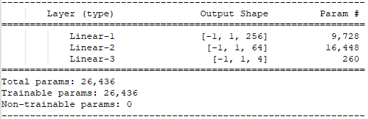
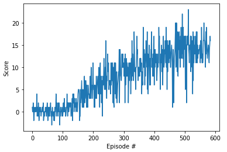

# Report

## Algorithm

The agent uses [Deep Q Learning](http://www.davidqiu.com:8888/research/nature14236.pdf). The implementation is based on the Udacity lesson on DQN.

## Network Architecture

The Neural Network has two fully connected hidden layers with ReLU activation.

## Hyper Parameters

- Replay Buffer Size: 1e5
- Batch Size: 64
- Gamma: 0.99
- Tau: 1e-3
- Learning Rate: 5e-4
- Update Frequency: 4

## Training

The training took between 540 and 620 episodes, to reach a mean score of over 13 in 100 episodes.

## Future Improvements

There are several possibilities to improve the performance of the agent:

* [DDQN](https://arxiv.org/abs/1509.06461)
* [Prioritized Experience Replay](https://arxiv.org/abs/1511.05952)
* [Dueling DQN](https://arxiv.org/abs/1511.06581) 

